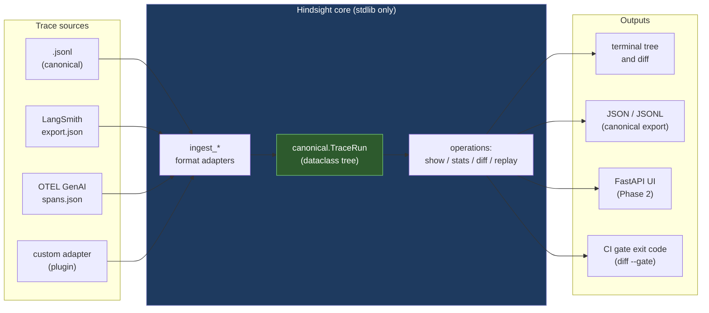

# ARCHITECTURE

## One-screen view



## Canonical data shape (the spine)

```python
# src/hindsight/canonical.py — overview
class StepKind(Enum):
    AGENT = "agent"     # a sub-agent boundary (start/stop pair)
    LLM = "llm"         # one model call (the leaf of cost)
    TOOL = "tool"       # one tool/function call
    DECISION = "decision"  # routing/branch (no model call, no tool)

@dataclass
class TraceStep:
    id: str
    parent_id: Optional[str]
    kind: StepKind
    name: str                            # human-readable label
    request: Optional[dict]              # serializable, type-known
    response: Optional[dict]
    error: Optional[str]
    latency_ms: int
    tokens_in: int = 0
    tokens_out: int = 0
    model: Optional[str] = None          # e.g. "claude-sonnet-4-6"
    started_at: Optional[str] = None     # ISO-8601
    extra: dict = field(default_factory=dict)   # adapter-local overflow

@dataclass
class TraceRun:
    id: str
    source: str                          # "jsonl" | "langsmith" | "otel" | ...
    started_at: Optional[str]
    finished_at: Optional[str]
    steps: list[TraceStep]               # flat list; parent_id encodes tree
    # convenience
    def root(self) -> TraceStep: ...
    def children_of(self, step_id: str) -> list[TraceStep]: ...
    def total_tokens(self) -> tuple[int, int]: ...
    def total_latency_ms(self) -> int: ...
```

Two design choices worth defending:

1. **Flat steps + `parent_id`** rather than nested dataclasses. Tree views are cheap to compute; serialization is trivial; the JSONL on disk has one step per line (greppable, awk-able). Nested dataclasses look prettier in code but make diff (which needs index-by-id) and partial loading harder.

2. **`extra: dict`** for adapter-local overflow. The canonical schema can't anticipate every field LangSmith or OTEL emits in 2027. The `extra` dict absorbs the unknowns without forcing a schema migration. Adapters write their vendor-specific fields under `extra["langsmith"]`, `extra["otel"]`, etc. Diff and stats ignore `extra` by default; `show` surfaces it when `--verbose` is set.

## Ingest adapters

Each adapter is a single file ~80 lines of stdlib Python. The interface:

```python
def ingest(path: pathlib.Path) -> TraceRun: ...
```

The contract:

* The same logical run, exported by any of LangSmith / OTEL / Hindsight-native JSONL, must produce *byte-identical canonical JSON* when re-serialized via `canonical.to_jsonl()`.
* Unknown fields are preserved under `extra[<source>]`.
* The adapter is allowed to *invent* IDs if the source doesn't carry them, but the IDs must be deterministic (e.g. SHA-1 over span content).
* Order in the canonical step list = topologically-sortable (`parent_id` precedes its children).

This contract is tested by the spike's cross-format-identity assertion.

## Operations

### `show(run, *, depth=None, color=True, verbose=False)`

Walks the tree from root and emits a terminal-pretty layout. Each step shows: kind icon, name, model (if LLM), tokens, latency, error if any. Children are indented under their parent. Pure-Python, no Rich.

### `stats(run) -> dict`

Aggregates over the flat step list: per-kind counts, per-model token totals, per-tool call counts, error count, total latency, p50/p95 step latency. Returns a dict (also pretty-printable via `--format=text`).

### `diff(run_a, run_b) -> Divergence`

Step-by-step alignment. Tries to match steps from `a` to `b` by:

1. Same path-from-root (sequence of `(kind, name)` tuples up to that step).
2. Within matched paths, line up by `started_at` order.
3. For each aligned pair, compare `request`, `response`, `error`, `model`. Report the first inequality.
4. Unmatched steps in either side are reported as "only in A" / "only in B".

Returns a `Divergence(first_divergent_step_id_a, first_divergent_step_id_b, reason)`. Pretty-printed side-by-side in the terminal.

The diff algorithm is intentionally **simple, deterministic, and explainable**. We are not trying to use LLMs to explain agent failures; we are giving the FDE the structural delta and letting them think. Future work (Phase 3): an optional LLM-judge that takes the divergence and proposes a plain-English diagnosis. For v0.1, deterministic only.

### `replay(run, *, from_step, model_override=None, live=False)` — v0.2 (not in spike)

For step indices < `from_step`, substitute recorded responses verbatim. For step indices >= `from_step`, re-issue the LLM call live against the API. If `model_override` is set, swap the model for those re-issued calls. Tool calls during replay either (a) re-emit recorded tool responses (default — "what would the agent have done with that tool result?") or (b) actually re-execute the tool (behind `--live-tools`, dangerous for stateful tools).

Replay produces a *new* `TraceRun` that itself can be `diff`-ed against the original. This is the punchline of the demo: "let me show you what would have happened with Sonnet instead of Haiku."

## Failure modes (the things that will burn me)

* **OTEL GenAI semantic conventions are experimental.** As of [the May 2026 spec](https://opentelemetry.io/docs/specs/semconv/gen-ai/), the conventions still carry "experimental" warnings. Schema drift is real. Mitigation: pin a version per release; document supported version; fail loud with a clear error.

* **LangSmith export shape changes.** LangSmith is SaaS and they can change the export shape unilaterally. Mitigation: snapshot a frozen sample, write the adapter against it, document the snapshot date, accept that releases may need to bump on schema change.

* **Vendor-specific fields lost on round-trip.** If an `extra["langsmith"]` field is dropped by mistake, diff lies. Mitigation: the cross-format-identity test compares `extra` dicts too; deviation breaks CI.

* **Diff false positives from timestamp jitter or token-count nondeterminism.** Two "equivalent" runs may have slightly different token counts (caching, billing rounding). Mitigation: diff ignores `tokens_*` and `latency_ms` by default; opt-in `--strict` to compare them.

* **Replay dependency on tool determinism.** If a tool produces different output on re-execution (e.g. `get_current_time()`), replay is meaningless. Mitigation: default to "use recorded tool responses"; `--live-tools` is opt-in with explicit warning.

* **PII in traces.** Customer traces are likely to contain customer data. Hindsight runs locally, never phones home. No telemetry. Phase 2: a `hindsight redact` command to strip configurable fields before sharing.

## Where each LLM call happens

* **Never in v0.1 core.** The spike, all of `show` / `stats` / `diff`, and the ingesters touch zero LLMs.
* **Only in v0.2 `replay --live`.** That's the only code path that imports the `anthropic` or `openai` SDK and makes an HTTP request.
* **Phase 3 `diff --explain`.** Optional Haiku call (or local model) to produce a one-paragraph plain-English diagnosis of the divergence. Always opt-in, always behind a flag.

This is deliberate. The hottest customer concern is "will this tool exfiltrate our traces?" — the answer is "the default install cannot, by construction. No network code on the critical path." That property is more valuable than any feature.

## Comparison against the field (architectural)

| | Langfuse | LangSmith | Phoenix | Laminar | Helicone | **Hindsight** |
|---|---|---|---|---|---|---|
| Hosted SaaS option | yes | yes | (cloud beta) | yes | yes | **no** |
| Self-host | yes (Postgres+CH) | no | yes | yes | yes (k8s) | **n/a — local single-binary** |
| Reads OTEL GenAI | yes (its own SDK) | partial | native | yes | partial | **yes (any conformant export)** |
| Reads LangSmith export | no | n/a | partial | partial | no | **yes** |
| Reads custom JSONL | via SDK | no | via SDK | yes | via SDK | **yes** |
| Diff two runs structurally | no | partial (LangChain only) | no | rollout debugger | no | **yes** |
| Replay from arbitrary step with model swap | no | LangChain only | no | no | no | **yes (v0.2)** |
| Zero account required | no | no | partial | partial | no | **yes** |
| Dep on Postgres / ClickHouse | yes | n/a | no | no | yes | **no** |
| stdlib-only core | no | no | no | no | no | **yes** |

The "yes" column for Hindsight is the empty quadrant. Whether the empty quadrant is empty because nobody wants it or because nobody has built it yet is the bet. The trendlines (more agents in production, OTEL standardising, OSS gravity, customer-data-stays-local pressure) say it's the latter.
